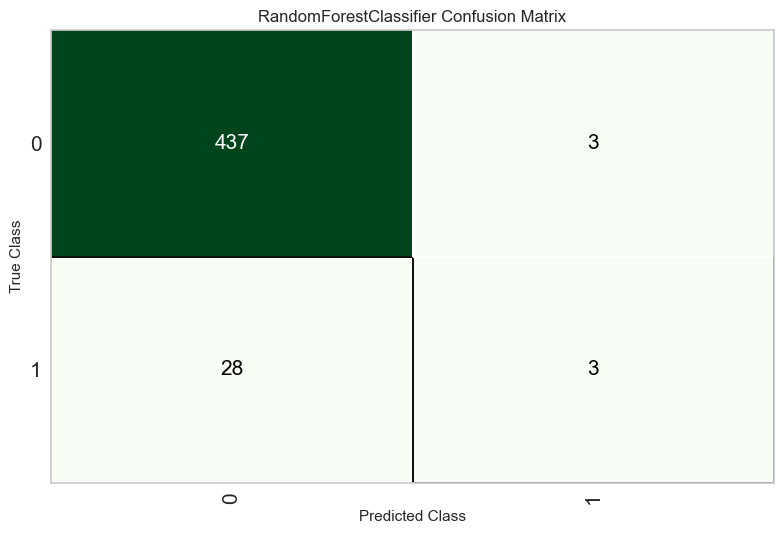

# Model Performance Report (Phase 1)

## 1. Overview (概述)
本專案初步採用 **Random Forest (隨機森林)** 進行基準測試。使用 PyCaret 自動化機器學習框架進行 10-Fold Cross Validation。

## 2. Evaluation Metrics (評估指標)
| Metric | Score (Mean) | 說明 |
| :--- | :--- | :--- |
| **Accuracy** | **93.43%** | 整體準確率極高，但受樣本不平衡影響大。 |
| **AUC** | 0.7209 | 模型區分良品/不良品的能力尚可 (大於 0.7)。 |
| **Recall** | **2.86%** | **關鍵發現**：模型傾向於預測「Pass」，導致大量漏抓不良品 (False Negative)。 |
| **Precision**| 15.00% | 在預測為 Fail 的樣本中，誤報率較高。 |

## 3. Visualizations (視覺化分析)

### Confusion Matrix

*分析：模型在預測 "Label 0" (良品) 時非常準確，但在 "Label 1" (不良品) 上幾乎失效。這證實了資料極度不平衡 (Imbalance) 是主要痛點。*

### Feature Importance

*分析：Random Forest 識別出的前幾名關鍵感測器特徵，將作為後續製程改善的重點監控對象。*

### ROC / AUC Curve

*分析：AUC 曲線顯示模型在不同閾值下的表現，0.72 的分數表示模型具有一定的區分能力，但仍有很大優化空間。*

## 4. Phase 1 Conclusion & Next Steps (結論與下一步)
目前的模型雖然有高達 93% 的準確率，但這是一個「陷阱」。對於半導體製程而言，**Recall (抓出壞品)** 比 Accuracy 更重要。

**Phase 2 優化策略：**
1.  **引入 SMOTE/ADASYN**：透過演算法生成虛擬的不良品樣本，強迫模型學習 "Fail" 的特徵。
2.  **更換模型**：嘗試對不平衡資料更敏感的 XGBoost 或 LightGBM (或是 CatBoost)。
3.  **調整閾值 (Threshold Tuning)**：犧牲部分 Precision 來換取更高的 Recall。